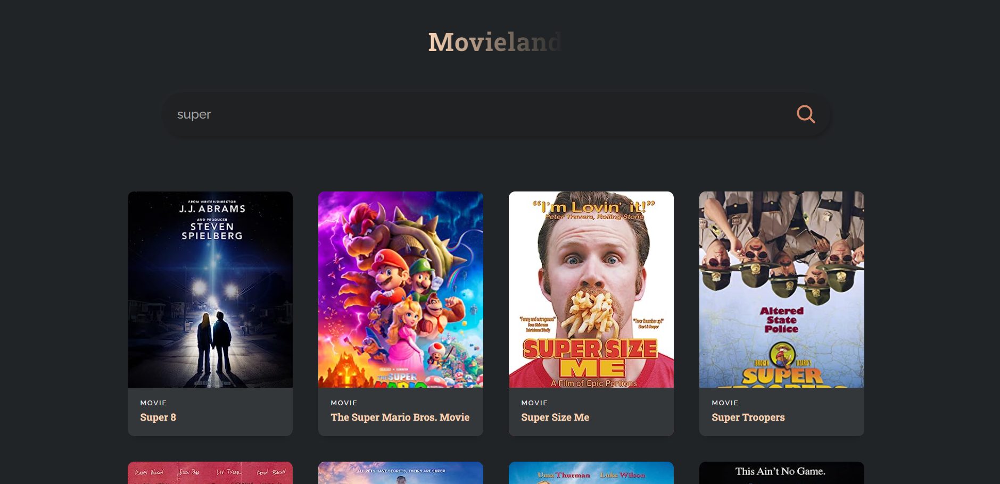

# Movie Search Deployed
Refactored Movie Search app using React, Express, and Node 
to deploy via Render and Vercel.
 
Gets data from the OMDB API.
Check it out [HERE](https://movie-search-deployed.vercel.app/).

# Showcase Image

 

# What I learned
* How to create a custom react component 
* How to use basic react Hooks